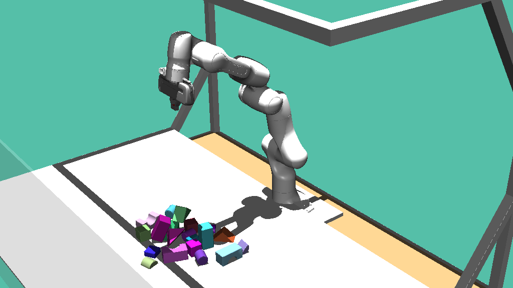

# Push to See (pts)

[Push to See](https://ieeexplore.ieee.org/document/9811645) implementation in PyTorch.
Implementation using [SimulationFramework](https://github.com/ALRhub/SimulationFramework)



### Installation

This repository requires the internally developed SimulationFramework package. If
you have access to the ALRhub organization on GitHub, please install this package
first. Otherwise, you need to contact the ALR institute to get access.

Install this package as any other python package:
```bash
    pip install -e ".[dev]"
```